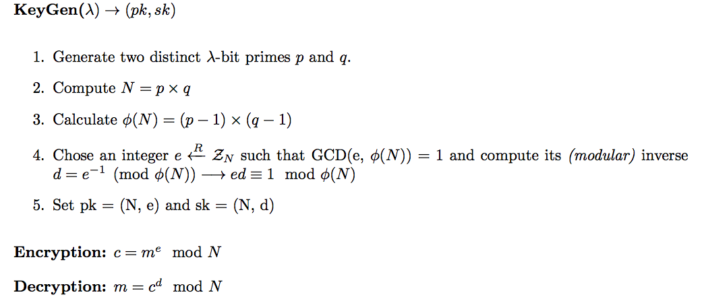

# CR3: What is this encryption? 150p
Fady assumed this time that you will be so n00b to tell what encryption he is using
he send the following note to his friend in plain sight:
```
p=0xa6055ec186de51800ddd6fcbf0192384ff42d707a55f57af4fcfb0d1dc7bd97055e8275cd4b78ec63c5d592f567c66393a061324aa2e6a8d8fc2a910cbee1ed9

q=0xfa0f9463ea0a93b929c099320d31c277e0b0dbc65b189ed76124f5a1218f5d91fd0102a4c8de11f28be5e4d0ae91ab319f4537e97ed74bc663e972a4a9119307

e=0x6d1fdab4ce3217b3fc32c9ed480a31d067fd57d93a9ab52b472dc393ab7852fbcb11abbebfd6aaae8032db1316dc22d3f7c3d631e24df13ef23d3b381a1c3e04abcc745d402ee3a031ac2718fae63b240837b4f657f29ca4702da9af22a3a019d68904a969ddb01bcf941df70af042f4fae5cbeb9c2151b324f387e525094c41

c=0x7fe1a4f743675d1987d25d38111fae0f78bbea6852cba5beda47db76d119a3efe24cb04b9449f53becd43b0b46e269826a983f832abb53b7a7e24a43ad15378344ed5c20f51e268186d24c76050c1e73647523bd5f91d9b6ad3e86bbf9126588b1dee21e6997372e36c3e74284734748891829665086e0dc523ed23c386bb520
```
He is underestimating our crypto skills!

## Recover d
This challenge requires some knowledge about basic crypto algorithms. Based on the variables that Fady sent we assumed this was RSA. A formal definition of the RSA algorithm can be expressed as the following:



Since we know `p, q, e, c` we can easily calculate the private key `d`, luckily for us we have https://github.com/ius/rsatool that can do it for us.

```console
λ ~/Downloads/crypto03/ ./rsatool/rsatool.py -p 0xa6055ec186de51800ddd6fcbf0192384ff42d707a55f57af4fcfb0d1dc7bd97055e8275cd4b78ec63c5d592f567c66393a061324aa2e6a8d8fc2a910cbee1ed9 -q 0xfa0f9463ea0a93b929c099320d31c277e0b0dbc65b189ed76124f5a1218f5d91fd0102a4c8de11f28be5e4d0ae91ab319f4537e97ed74bc663e972a4a9119307 -e 0x6d1fdab4ce3217b3fc32c9ed480a31d067fd57d93a9ab52b472dc393ab7852fbcb11abbebfd6aaae8032db1316dc22d3f7c3d631e24df13ef23d3b381a1c3e04abcc745d402ee3a031ac2718fae63b240837b4f657f29ca4702da9af22a3a019d68904a969ddb01bcf941df70af042f4fae5cbeb9c2151b324f387e525094c41
Using (p, q) to initialise RSA instance

n =
a22b591571af4e0d465774b82ccd9952eb479fdfdd551800c2940b1c114e25414fc62c60086563df
6cba2fc164cafd0db253299dddfa57d8c4e87af9f271ef9e0cb10ab85139e5cf52ae39ff7f833380
fbf3439e374c31ea26b2224b2d18cb194e3b3bb13cd6409c978e3e8ff35794ed4cf8cad0305b2b05
b2ee66c09ca272ef

e =
6d1fdab4ce3217b3fc32c9ed480a31d067fd57d93a9ab52b472dc393ab7852fbcb11abbebfd6aaae
8032db1316dc22d3f7c3d631e24df13ef23d3b381a1c3e04abcc745d402ee3a031ac2718fae63b24
0837b4f657f29ca4702da9af22a3a019d68904a969ddb01bcf941df70af042f4fae5cbeb9c2151b3
24f387e525094c41

d =
1af78e760bba4f7b55ffffd7b9f22090a00f9ac629697fd7a971b64f81d6a3bbf6c552c3c29abe5a
ea07257e6fcfd2f63186da31252bbe03278732f8a4d8f7f35f8cbed38ac95f5be92aedbf09341475
0d11acb8a00afc9abf4d3b496d849436ef1826c27a03e362ed62f74ccc421f8c3e62d6b596757822
0808b3f62b2f6c71

p =
a6055ec186de51800ddd6fcbf0192384ff42d707a55f57af4fcfb0d1dc7bd97055e8275cd4b78ec6
3c5d592f567c66393a061324aa2e6a8d8fc2a910cbee1ed9

q =
fa0f9463ea0a93b929c099320d31c277e0b0dbc65b189ed76124f5a1218f5d91fd0102a4c8de11f2
8be5e4d0ae91ab319f4537e97ed74bc663e972a4a9119307
```

Now we know `n` and `d`, we begin to decrypt the ciphertext `c` by creating a simple python script:

```python
#!/usr/bin/env python
import binascii

p = int('0xa6055ec186de51800ddd6fcbf0192384ff42d707a55f57af4fcfb0d1dc7bd97055e8275cd4b78ec63c5d592f567c66393a061324aa2e6a8d8fc2a910cbee1ed9', 16)
q = int('0xfa0f9463ea0a93b929c099320d31c277e0b0dbc65b189ed76124f5a1218f5d91fd0102a4c8de11f28be5e4d0ae91ab319f4537e97ed74bc663e972a4a9119307', 16)
e = int('0x6d1fdab4ce3217b3fc32c9ed480a31d067fd57d93a9ab52b472dc393ab7852fbcb11abbebfd6aaae8032db1316dc22d3f7c3d631e24df13ef23d3b381a1c3e04abcc745d402ee3a031ac2718fae63b240837b4f657f29ca4702da9af22a3a019d68904a969ddb01bcf941df70af042f4fae5cbeb9c2151b324f387e525094c41', 16)
c = int('0x7fe1a4f743675d1987d25d38111fae0f78bbea6852cba5beda47db76d119a3efe24cb04b9449f53becd43b0b46e269826a983f832abb53b7a7e24a43ad15378344ed5c20f51e268186d24c76050c1e73647523bd5f91d9b6ad3e86bbf9126588b1dee21e6997372e36c3e74284734748891829665086e0dc523ed23c386bb520', 16)
N = int('0xa22b591571af4e0d465774b82ccd9952eb479fdfdd551800c2940b1c114e25414fc62c60086563df6cba2fc164cafd0db253299dddfa57d8c4e87af9f271ef9e0cb10ab85139e5cf52ae39ff7f833380fbf3439e374c31ea26b2224b2d18cb194e3b3bb13cd6409c978e3e8ff35794ed4cf8cad0305b2b05b2ee66c09ca272ef', 16)

d = int('0x1af78e760bba4f7b55ffffd7b9f22090a00f9ac629697fd7a971b64f81d6a3bbf6c552c3c29abe5aea07257e6fcfd2f63186da31252bbe03278732f8a4d8f7f35f8cbed38ac95f5be92aedbf093414750d11acb8a00afc9abf4d3b496d849436ef1826c27a03e362ed62f74ccc421f8c3e62d6b5967578220808b3f62b2f6c71', 16)

m = hex(pow(c, d, N)).rstrip("L").replace("0x","")

print(binascii.unhexlify(m))
```

Let's run the code:

```console
λ ~/Downloads/crypto03/ python solve.py
ALEXCTF{RS4_I5_E55ENT1AL_T0_D0_BY_H4ND}
```