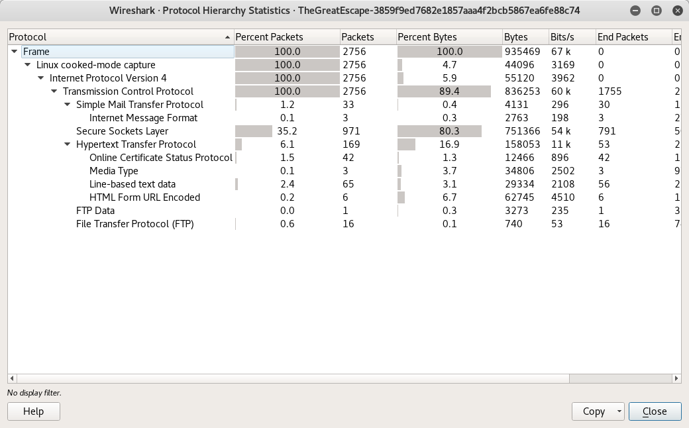
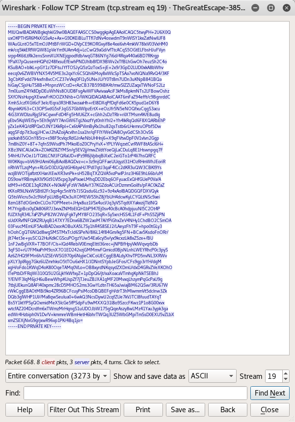
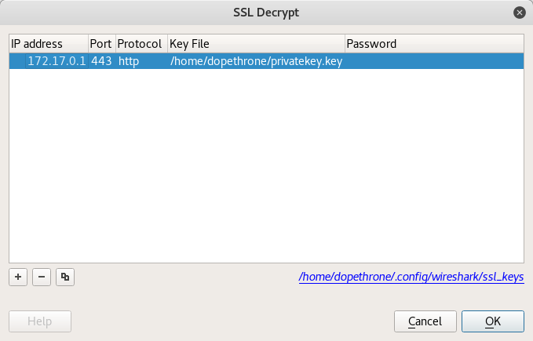

# Insomni'hack teaser - The Great Escape I (forensics 50)
The challenge was in the forensic category and all we got was a .pcap-file to analyze.

## Recon



We opened the file in wireshark and started analyzing. While looking through the packets we recognized that almost the whole communication was encrypted. To get an overview over the used protocols we looked at the Protocol Hierarchy *(Statistics -> Protocol Hierarchy)*.  We see SMTP and FTP, sweet! 

## Extraction

We filtered for ftp-data packets and followed the TCP stream (Follow -> TCP Stream) which revealed that bob was uploading his private key in plaintext. (goddamn it bob!) 



With the help of the private key we were able to decrypt the communication and get the flag.



To decrypt the packets in wireshark just go to:
Edit -> Preferences -> Protocols -> SSL -> RSA keylist import the keyfile and enter the IP for the host communicating over SSL.

## Can I haz flag?

The following HTTP header was found in the decrypted HTTP requests *(Right-click packet -> Follow -> HTTP)*.

```
POST /api/user.php HTTP/1.1
Host: ssc.teaser.insomnihack.ch
User-Agent: Mozilla/5.0 (X11; Ubuntu; Linux x86_64; rv:50.0) Gecko/20100101 Firefox/50.0
Accept: application/json, text/plain, */*
Accept-Language: en-US,en;q=0.5
Accept-Encoding: gzip, deflate, br
Content-Type: application/x-www-form-urlencoded
Referer: https://ssc.teaser.insomnihack.ch/login
Content-Length: 38
Cookie: PHPSESSID=3u5dqmfudc7ap1di0nmfjgtjm3
FLAG: INS{OkThatWasWay2Easy}
Connection: keep-alive
```

We got the flag: `INS{OkThatWasWay2Easy}`


