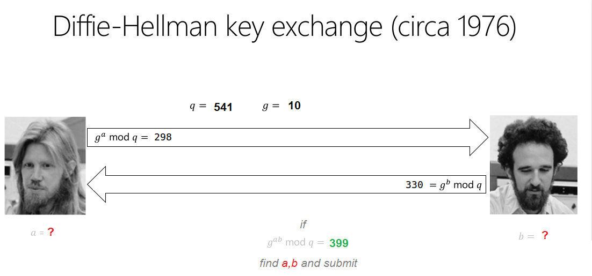

### Crypto2 [350]: Breaking bad key exchange
Challenge: 
```
Hint 1 : in the range (1 to g*q), there are couple of pairs yielding common secrete as 399. 
Hint 2 : 'a' and 'b' both are less than 1000 
Flag Format: flag{a,b}
```


#### Solution:
TODO: Clean the code
```python
import numpy as np
q=541
g=10

alist=[]
aplus=[]
gaplus=[]
for a in range(1,1000,1):
  if(a<3):
    v=np.power(g,a)%q
    alist.append(v)
  else:
    v=(alist[a-2]*g)%q
    alist.append(v)
  if v==298:
    aplus.append(a)
    gaplus.append(v)


blist=[]
bplus=[]
gbplus=[]
for b in range(1,1000,1):
  if(b<3):
    v=np.power(g,b)%q
    blist.append(v)
  else:
    v=(blist[b-2]*g)%q
    blist.append(v)
  if v==330:
    bplus.append(b)
    gbplus.append(v)

gabplus=[]
for i in range(0,len(aplus),1):
  for j in range(0,len(bplus),1):
    for pw in range(1,bplus[j],1):
      if(pw<3):
        v=np.power(gaplus[i],pw)%q
        gabplus.append(v)
      else:
        v=(gabplus[pw-2]*gaplus[i])%q
        gabplus.append(v)
      if(v==399):
        print "flag{"+str(aplus[i])+","+str(bplus[j])+"}"
```