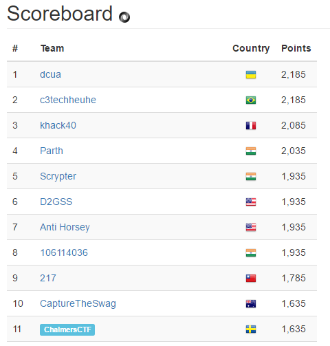

# Pragyan CTF 2017 Writeups

### Final team rank: 11th

## Problems:

##### Binary Exploitation
* [Answer to Everything (50pts)](bin1/README.md)
* [Shane and the binary files (100pts)](bin2/README.md)
* [Roller Coaster Ride (150pts)](bin3/README.md)

##### Cryptography
*  [Game of Fame (50pts)](cr1/README.md)
*  [Evil Corp (100pts)](cr2/README.md)
*  [Kane Chronicles (100pts)](cr3/README.md) [NOT SOLVED]
*  [The Jigsaw Killer (100pts)](cr4/README.md) [NOT SOLVED]

##### Forensics
* [Look Harder (50pts)](for1/README.md)
* [Interstellar (150pts) ](for2/README.md)
* [The Karaboudjan (150pts)](for3/README.md)

##### Misc
*  [The Vault (75pts)](misc2/README.md)

##### Reverse Engeneering
*  [MI6 (100pts) ](rev1/README.md)

##### Steganography
*  [Star Wars (100pts) ](steg1/README.md)
*  [Black Is The New Rose (150pts) ](steg2/README.md) [NOT SOLVED]
*  [Lost Friends (300pts)  ](steg3/README.md)
*  [New Avenger (300pts)](steg4/README.md)

##### Web
*  [Give The Guy (100pts)](web1/README.md)
*  [Supreme Leader (150pts) ](web2/README.md)