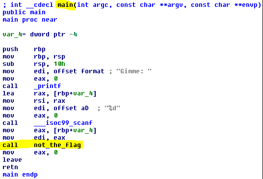
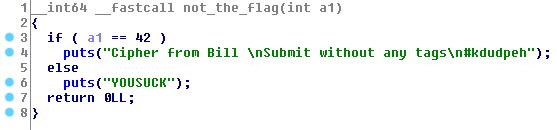

## Answer to Everything (50pts)
By: [ChalmersCTF](http://chalmersctf.se)

##### Challenge Description : 
```
Shal has got a binary. It contains the name of a wise man and his flag. He is unable to solve it.

Submit the flag to unlock the secrets of the universe.

NOTE :- Please enclose the flag in the format pragyanctf{<flag>}.

Hint! Sometimes, the best place to hide is plain sight.
Hint! SHAl didn't try one thing, which is what he is.
```
* File : [main.exe](files/main.exe)

#### Solution:

I started by firing up the IDA to analyze the binary after running ```file``` which told me its an ```ELF64``` binary.
After looking fast at the disassembly I could see that it first asks for an input (a number) then call a function ```not_the_flag()```

The function looked like this:

We tried to submit the flag as ```pragyanctf{kdudpeh}``` but it did not work. Looking at the released hints we realized we should use the SHA1 representation of the word. And we got the flag.
```pragyanctf{80ee2a3fe31da904c596d993f7f1de4827c1450a}```
