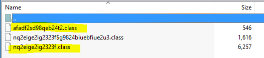

## Shane and the binary files (100pts) 
By: [noras] from [ChalmersCTF](http://chalmersctf.se)

##### Challenge Description : 
```
Shane is a part of one of the teams in the FBI, which is currently handling a very weird cyber crime case. As a part of the investigation, Shane was asked to analyze a series of binary files, one of which is known to give out a password. Shane got the files in a zip file named "parallel.zip". Could you help him do it ?

NOTE :- Please enclose the flag in the format pragyanctf{<flag>}.

```
* File : [parallel.zip](files/parallel.zip)

#### Solution:

After decompressing the zip file, I could see three ***.class*** files, which are java compiled binaries. 



So I decompiled them using [http://www.javadecompilers.com]( http://www.javadecompilers.com) and got [the java files](files/decompiled.zip).
The biggiest file **nq2eige2ig2323f.java** was the most interesting one.  It had:
* An array of characters
* And some kind of validation method where on success it prints out something from this array in a specific order.

Copying both the array and print output and making a [python script](files/solver_bin2.py) revealed the output.
```
Congratulations ! You're right ! The flag is aKMqGxs4duK7PxM33Bln
```
### Script:
```python
arrayOfChar=[]
for i in range(66):
	arrayOfChar.append('null')
arrayOfChar[0] = 'l';
arrayOfChar[1] = 'k';
arrayOfChar[2] = 'i';
arrayOfChar[3] = 'q';
arrayOfChar[4] = 'j';
arrayOfChar[5] = 'v';
arrayOfChar[6] = 'o';
arrayOfChar[7] = 'd';
arrayOfChar[8] = 'e';
arrayOfChar[9] = 'b';
arrayOfChar[10] = 't';
arrayOfChar[11] = 'r';
arrayOfChar[12] = 'w';
arrayOfChar[13] = 'a';
arrayOfChar[14] = 'n';
arrayOfChar[15] = 'm';
arrayOfChar[16] = 'p';
arrayOfChar[17] = 'g';
arrayOfChar[18] = 'z';
arrayOfChar[19] = 'h';
arrayOfChar[20] = 'u';
arrayOfChar[21] = 'x';
arrayOfChar[22] = 'f';
arrayOfChar[23] = 'c';
arrayOfChar[24] = 'y';
arrayOfChar[25] = 's';
arrayOfChar[26] = 'E';
arrayOfChar[27] = 'A';
arrayOfChar[28] = 'K';
arrayOfChar[29] = 'V';
arrayOfChar[30] = 'Z';
arrayOfChar[31] = 'F';
arrayOfChar[32] = 'M';
arrayOfChar[33] = 'I';
arrayOfChar[34] = 'H';
arrayOfChar[35] = 'O';
arrayOfChar[36] = 'Y';
arrayOfChar[37] = 'B';
arrayOfChar[38] = 'L';
arrayOfChar[39] = 'C';
arrayOfChar[40] = 'Q';
arrayOfChar[41] = 'N';
arrayOfChar[42] = 'J';
arrayOfChar[43] = 'W';
arrayOfChar[44] = 'S';
arrayOfChar[45] = 'G';
arrayOfChar[46] = 'U';
arrayOfChar[47] = 'T';
arrayOfChar[48] = 'P';
arrayOfChar[49] = 'D';
arrayOfChar[50] = 'R';
arrayOfChar[51] = '1';
arrayOfChar[52] = '2';
arrayOfChar[53] = '3';
arrayOfChar[54] = '4';
arrayOfChar[55] = '5';
arrayOfChar[56] = '6';
arrayOfChar[57] = '7';
arrayOfChar[58] = '8';
arrayOfChar[59] = '9';
arrayOfChar[60] = '0';
arrayOfChar[61] = '_';
arrayOfChar[62] = '.';
arrayOfChar[63] = '!';
arrayOfChar[64] = '\'';
arrayOfChar[65] = ' ';

flag=arrayOfChar[39] + arrayOfChar[6] + arrayOfChar[14] + arrayOfChar[17] + arrayOfChar[11] + arrayOfChar[13] + arrayOfChar[10] + arrayOfChar[20] + arrayOfChar[0] + arrayOfChar[13] + arrayOfChar[10] + arrayOfChar[2] + arrayOfChar[6] + arrayOfChar[14] + arrayOfChar[25] + arrayOfChar[65] + arrayOfChar[63]+arrayOfChar[65] + arrayOfChar[36] + arrayOfChar[6] + arrayOfChar[20] + arrayOfChar[64] + arrayOfChar[11] + arrayOfChar[8] + arrayOfChar[65] + arrayOfChar[11] + arrayOfChar[2] + arrayOfChar[17] + arrayOfChar[19] + arrayOfChar[10] + arrayOfChar[65] + arrayOfChar[63] + arrayOfChar[65] + arrayOfChar[47] + arrayOfChar[19] + arrayOfChar[8] + arrayOfChar[65] + arrayOfChar[22] + arrayOfChar[0] + arrayOfChar[13] + arrayOfChar[17] + arrayOfChar[65] + arrayOfChar[2] + arrayOfChar[25] + arrayOfChar[65] + arrayOfChar[13] + arrayOfChar[28] + arrayOfChar[32] + arrayOfChar[3] + arrayOfChar[45] + arrayOfChar[21] + arrayOfChar[25] + arrayOfChar[54] + arrayOfChar[7] + arrayOfChar[20] + arrayOfChar[28] + arrayOfChar[57] + arrayOfChar[48] + arrayOfChar[21] + arrayOfChar[32] + arrayOfChar[53] + arrayOfChar[53] + arrayOfChar[37] + arrayOfChar[0] + arrayOfChar[14]
print flag
```


