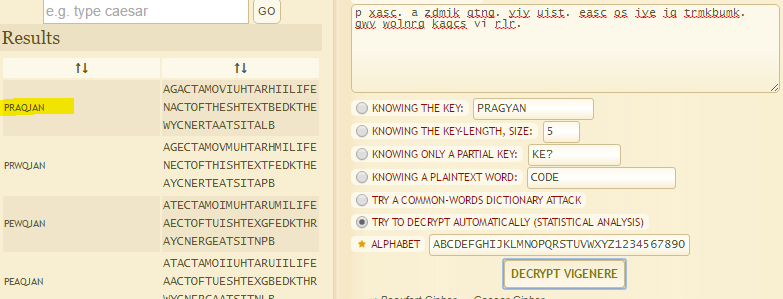

## Game of Fame (50pts) 
By: [noras] from [ChalmersCTF](http://chalmersctf.se)

##### Challenge Description : 
```

p xasc. a zdmik qtng. yiy uist. easc os iye iq trmkbumk. gwv wolnrg kaqcs vi rlr.

NOTE :- Please enclose the flag in the format pragyanctf{<flag>}.

Hint! The seven star-studded Pragyan walks into the hall of fame. Boom!
Hint! Robert Sedgewick


```

#### Solution:

Playing around with the cipher text on [this site](http://www.dcode.fr/vigenere-cipher) I noticed somthing interesting when using the **Vigenere Cipher**. And that was that it suggest that they key might be ```PRAQJAN```.



Using the CTF name ```PRAGYAN``` reveal the plain text which was.

```a game. a movie star. his wife. name of the cs textbook. the winner takes it all.```

So no flag but another hint. Using that with the hint they gave about ```Robert Sedgewick``` which are known for his book ```Algorithms``` the flag was **pragyanctf{Algorathims}**