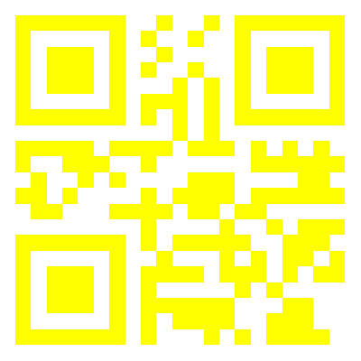

## Look Harder (50pts) 
By: [noras] from [ChalmersCTF](http://chalmersctf.se)

##### Challenge Description : 
```
There are rumours that in the Great Sahara Desert, a great treasure has been buried deep inside the ground, but the map for the exact location of the treasure over the years, has not been preserved properly.
You have got hold of the map, but it looks nothing more than a plain white sheet of paper. Can you make sense out of it ??


NOTE :- Please enclose the flag in the format pragyanctf{<flag>}.
```
* File : [treasure_map.png](images/treasure_map.png)

#### Solution:

So the image looked like this


Opening this in photoshop and playing with the levels reveald a qrcode.




Reading the QR code using this [Online QrCode Reader](https://zxing.org/w/decode.jspx) revealed the flag ```stay_pragyaned```