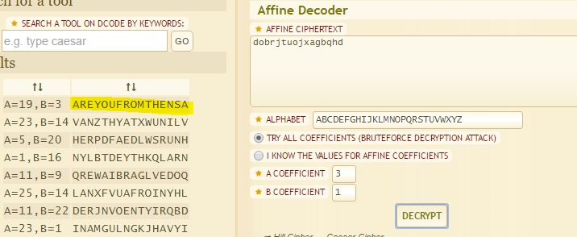

## Give The Guy (100pts) 
By: [ChalmersCTF](http://chalmersctf.se)

##### Challenge Description : 
```
Hacker G has a website. Can you use it to decipher this cipher text ?

Cipher text :- dobrjtuojxagbqhd

Link : http://139.59.62.216/give_the_guy/

NOTE :- Please enclose the flag in the format pragyanctf{<flag>}.

```

#### Solution:

After brute forcing the challenge, probing for hidden directories/files, it turned out that if you simply run **Affine-cipher** on the ciphertext, you get the flag...

