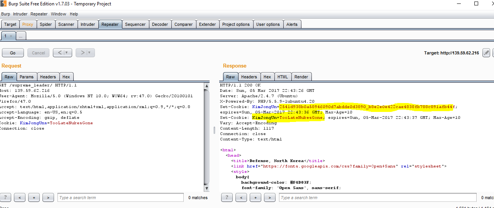
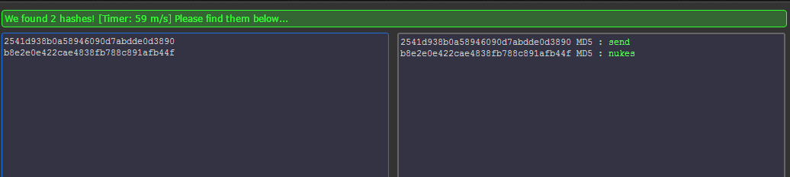

## Supreme Leader (150pts) 
By: [ChalmersCTF](http://chalmersctf.se)

##### Challenge Description : 
```

North Korea reportedly has a bioweapon in the making. Hack into their database and steal it.

Link : http://139.59.62.216/supreme_leader

NOTE :- Please enclose the flag in the format pragyanctf{<flag>}.

```


#### Solution:

Using burpsuite we could notice that there are two cookies getting set.



The first one does not apper when looking at the browser cookies because its getting over written have the value:

```2541d938b0a58946090d7abdde0d3890_b8e2e0e422cae4838fb788c891afb44```

using [hashkiller ]( https://hashkiller.co.uk/md5-decrypter.aspx ) we got :



flag: ```pragyanctf{send_nukes}```